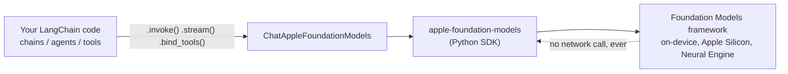

# langchain-apple-foundation-models

Use Apple's on-device Foundation Models as a drop-in LangChain chat model. Runs fully offline on macOS 26+ Apple Silicon -- no API key, no network call, no per-token cost.


```python
from langchain_apple_foundation_models import ChatAppleFoundationModels

llm = ChatAppleFoundationModels()
llm.invoke("What is the capital of France?")
```

## Install

```
pip install git+https://github.com/rajanshxrma/langchain-apple-foundation-models.git
```

(Not yet on PyPI -- installing from source for now.)

Requires macOS 26+ with Apple Intelligence enabled and Apple Silicon.

## Why

Apple shipped a Python SDK for its on-device model this year (`apple-foundation-models`), but there was no LangChain provider for it -- meaning none of LangChain's chains, agents, or tool-calling abstractions could target Apple's on-device model. This closes that gap.

## Features

- **Tool calling**: pass LangChain `@tool`-decorated functions via `.bind_tools([...])`, same as any other LangChain chat model.
- **Structured output**: `.with_structured_output(schema)` for JSON-schema or Pydantic-constrained generation.
- **Streaming**: `.stream(...)` yields tokens as they're generated.
- Zero network calls -- generation happens entirely on-device via Apple's Neural Engine.

## Architecture



`ChatAppleFoundationModels` implements LangChain's standard chat model interface, so it drops into any existing chain, agent, or tool-calling setup as a swap-in for a cloud provider -- the only difference is generation happens on-device.

## Example: tool calling

```python
from langchain_core.tools import tool
from langchain_apple_foundation_models import ChatAppleFoundationModels

@tool
def get_weather(city: str) -> str:
    """Get the current weather for a city."""
    return f"The weather in {city} is sunny and 72F."

llm = ChatAppleFoundationModels().bind_tools([get_weather])
llm.invoke("What's the weather in Austin?")
```

## Known limitations

- **Multi-turn history is owned by the underlying `Session`, not LangChain's message list.** Each `ChatAppleFoundationModels` instance lazily creates one on-device `Session` and reuses it across calls; if you pass a message list that diverges from what the session itself has tracked, the two can get out of sync. Fresh chains work naturally; manually-edited history does not yet.
- Built on the [`apple-foundation-models`](https://github.com/btucker/apple-foundation-models-py) unofficial Python bindings (alpha), which itself wraps Apple's Foundation Models framework -- both inherit Apple's current 4,096-token context window.
- No support (yet) for Apple's newer multi-model / Private Cloud Compute routing announced at WWDC26 -- that requires an OS/SDK combination not yet stable enough to depend on. See the repo issues for status.

## License

MIT
